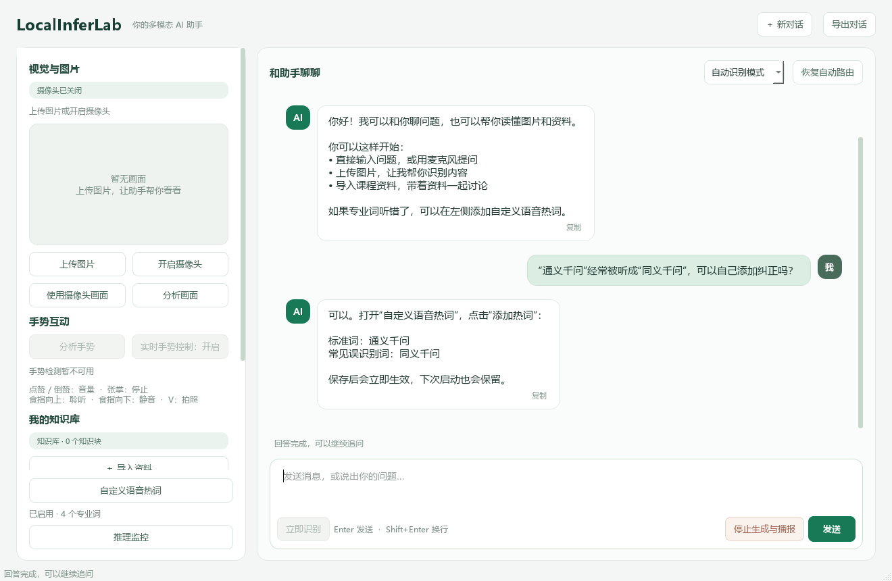
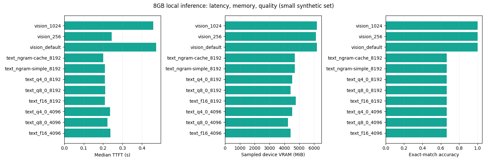
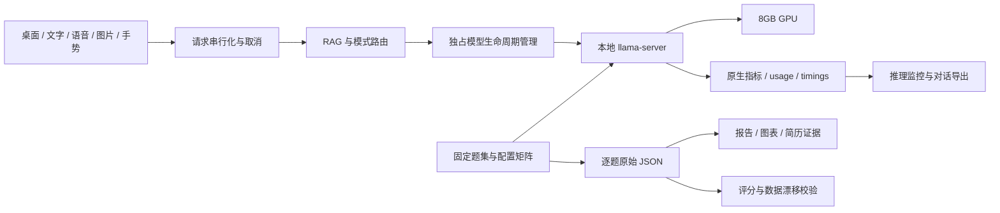

<p align="center">
  
</p>

<h1 align="center">LocalInferLab</h1>

<p align="center"><strong>8GB 显存约束下的本地多模态助手与推理实验台</strong></p>
<p align="center">对话 · 视觉 · 语音 · 知识库 · 手势控制 · 可复现实验</p>

<p align="center">
  <a href="https://github.com/NJNAN/local-multimodal-ai-assistant/actions/workflows/checks.yml"></a>
  
  
  
</p>

<p align="center">
  <a href="#项目亮点">项目亮点</a> ·
  <a href="#实测结果">实测结果</a> ·
  <a href="#快速开始">快速开始</a> ·
  <a href="benchmarks/README.md">实验复现</a> ·
  <a href="RESUME.md">简历与面试</a>
</p>

---

LocalInferLab 将完整的桌面 AI 交互与推理工程实验放在同一项目中：通过 `llama-server` 按需加载文本、视觉模型，结合本地语音识别、FAISS 检索和 MediaPipe 手势控制；进一步测量 KV 量化、N-gram 投机解码、图像 token 预算和缓存恢复的实际收益。

**从功能演示到可核查证据**：每次基准记录逐题回答、质量评分、真实 token、耗时、显存采样与模型 / 引擎哈希，自动生成报告，再由 CI 校验数据与报告的一致性。

## 项目亮点

| 方向 | 已实现能力 |
| :--- | :--- |
| 多模态交互 | 流式文字对话、图片上传与视觉追问、摄像头分析、SenseVoice 语音识别、语音播报 |
| 本地知识库 | 多格式文档导入，Sentence Transformers + FAISS 检索，来源页码与索引持久化 |
| 稳定手势控制 | 六类动作、关节角度与宽高比修正、连续确认、保持期间单次触发、释放后重新激活 |
| 资源与任务管理 | 文本 / 视觉模型独占切换、空闲卸载、流式取消、最新请求队列、完整对话导出 |
| 推理可观测性 | 原生 Prometheus 指标、usage / timings、KV 与投机参数、只读监控与 JSON 导出 |
| 实验与质量门禁 | 11 组配置、90 次真实推理，固定题集、严格匹配评分、原始 JSON、离线交互报告 |

<p align="center">
  
</p>
<p align="center"><sub>真实 Qt 界面的离屏预览，使用示例对话展示布局；摄像头和麦克风未接入时，仍可使用文字、知识库与上传图片。</sub></p>

新版界面支持自定义语音热词：打开左侧“自定义语音热词”，添加标准词和常见误识别写法，保存后立即用于语音转写纠正，并在下次启动保留。摄像头按钮可释放设备、清空历史帧并重新开启。详细用法见 [界面与热词使用指南](docs/界面与热词使用指南.md)。

语音交互采用独立识别线程和最长录音保护，输入区可点击“立即识别”。回答按句提前播报并预合成下一句；默认使用 Windows 中文离线音色，也可切换到联网自然音色。

## 实测结果

测量设备为 **RTX 4060 Laptop GPU · 8GB**，本机 `llama.cpp` 使用 **Vulkan** 后端。下表是固定题集中的局部收益，完整矩阵同时保留质量失败与无收益结果。

| 实验场景 | 基线 p50 | 优化 p50 | 观察结果 | 质量检查 |
| :--- | ---: | ---: | :--- | :--- |
| 重复性中文复制 · N-gram cache | 58.37 tok/s | **118.28 tok/s** | 端到端吞吐 **2.03×** | 严格匹配 3/3 |
| 合成视觉题 · 图像 token 上限 256 | 0.473 s | **0.244 s** | TTFT **下降 48.3%** | 严格匹配 6/6 |

<p align="center">
  
</p>

**收益边界也属于结果。** 事实问答存在二进制转换错误，文本配置整体严格匹配为 6/9；落盘缓存恢复成功后仍未观察到前缀复用。显存是整卡采样，包含后台进程；本实验没有测量最大上下文或生产并发。上述加速数字仅适用于对应固定题目。

→ [完整结果](RESULTS.md) · [负面结果与解释](NEGATIVE-RESULTS.md) · [逐题原始数据](benchmarks/results/latest.json) · [可下载的离线交互报告](benchmarks/results/dashboard.html)

## 完整功能

- 麦克风采集、WebRTC VAD 与 SenseVoice 语音识别
- Qwen3.5 文本对话与流式输出
- Qwen3-VL 图像理解和多轮视觉问答
- Sentence Transformers + FAISS 本地知识库检索
- MediaPipe 人体姿态和手势识别
- Edge TTS 中英文语音合成
- PyQt5 桌面界面及端到端测试脚本
- 上传本地图片并多轮追问，无摄像头也能使用视觉理解
- 自动、文字 / 知识库、视觉三种模式的可视化选择
- 显示回答总耗时、首段输出耗时与检索资料来源
- 新对话、Markdown / JSON 完整对话导出、自动播报开关
- 知识库导入后保存索引，重启自动恢复
- 只读推理监控、原生 token / timing 显示与 JSON 导出
- 参数能力校验、真实模型基准、自动图表及数据一致性检查

## 系统架构



文本 / 视觉推理和知识库检索在本机执行；首次模型下载需要网络，**Edge TTS 播报需要网络**。高级推理参数需显式开启，默认助手配置保持原有行为。

## 快速开始

### 环境要求

- Windows 10/11
- Python 3.10（建议使用，项目支持范围为 3.10–3.11）
- 麦克风和摄像头（使用相关功能时）
- `llama-server`，可通过 `winget install ggml.llamacpp` 安装
- NVIDIA GPU 为可选项；CUDA 依赖见 `requirements-cuda.txt`

### 安装依赖

```powershell
python -m venv .venv
.\.venv\Scripts\Activate.ps1
python -m pip install -U pip
pip install -r requirements.txt
```

如需使用 NVIDIA GPU，再安装 CUDA 版 PyTorch：

```powershell
pip install -r requirements-cuda.txt
```

### 下载模型

模型权重体积较大，不包含在仓库中。可使用 Hugging Face CLI 下载：

```powershell
hf download bartowski/Qwen_Qwen3.5-4B-GGUF Qwen_Qwen3.5-4B-IQ4_XS.gguf --local-dir models/qwen3.5-4b
hf download Qwen/Qwen3-VL-4B-Instruct-GGUF Qwen3VL-4B-Instruct-Q4_K_M.gguf mmproj-Qwen3VL-4B-Instruct-Q8_0.gguf --local-dir models/qwen3-vl-4b
```

SenseVoice 和嵌入模型会在首次使用时由依赖库下载，也可通过环境变量指定本地路径：

- `MMAI_ASR_MODEL`
- `MMAI_EMBEDDING_MODEL`
- `MMAI_TEXT_GGUF`
- `MMAI_VL_GGUF`
- `MMAI_VL_MMPROJ`
- `MMAI_LLAMA_SERVER`

### 启动助手

双击 `start_assistant.bat`，或在 PowerShell 中运行：

```powershell
python scripts/00_check_env.py
python main.py
```

启动脚本依次查找 `MMAI_PYTHON` 指定的解释器、项目 `.venv`、原有 `D:\mm_ai_env` 和 `PATH` 中的 Python。
默认直接启动；完整依赖与硬件检查仍可通过以下命令运行：

```powershell
.\start_assistant.ps1 -CheckEnvironment
.\start_assistant.ps1 -NoAudio -NoVideo
.\start_assistant.ps1 -SmokeTest
```

无麦克风或摄像头时可使用：

```powershell
python main.py --no-audio --no-video
```

## 界面使用与课程演示

1. **文字问答**：输入问题后按 Enter，可继续追问。顶部选择“文字 / 知识库”可以固定文字模式。
2. **知识库问答**：导入 PDF、TXT、Markdown 或 DOCX 后提问，回答下方显示本次检索资料的文件名和页码。索引保存在 `data/knowledge/.index`，重启后继续使用。扫描版 PDF 需先进行 OCR。
3. **视觉问答**：点击“分析画面”使用最近两帧摄像头画面；点击“上传图片”选择本地图片，再输入问题。上传图片在切换回摄像头前可连续追问，窗口缩放时保留预览。
4. **语音与手势**：画面下方显示实时手势、手部数量和人体可见状态。“分析手势”可分析当前摄像头画面或上传图片，只显示结果。“实时手势控制”默认开启，摄像头识别到手势后执行动作：点赞增大音量、倒赞减小音量、张开手掌停止生成与播报、食指向上开启监听、食指向下切换静音、胜利 V 拍照。识别依据手指关节角度、弯曲程度和指向，并按图像宽高比修正坐标；不明确的姿势不执行动作。连续至少 4 次检测且保持至少 0.35 秒后确认，每次保持只执行一次；松手或移出画面至少 0.6 秒后可再次触发，所有动作之间至少间隔 2 秒。可单独暂停控制；“自动播报”也可以独立关闭。
5. **留存演示结果**：回答完成后点击“导出对话”，保存 Markdown 或 JSON。导出包含本次会话所有问答、取消状态、耗时与检索来源；模型的上下文仍只保留最近六轮，避免无限增长。
6. **推理监控与求职演示**：点击“推理监控”读取当前模型驻留、KV 类型、投机配置、活动请求和原生 `/metrics`。发送问题后可查看真实输出 token 和引擎解码速度。打开 `benchmarks/results/dashboard.html` 可筛选实验配置、核对逐题结果；矩阵运行和解释见 [实验方法](benchmarks/README.md)。

快捷键：Enter 发送、Esc 停止、Ctrl+L 聚焦输入、Ctrl+S 导出。
生成过程中发送新问题会进入单槽队列，连续发送时保留最新一条；停止会清空排队请求。被取消的回答不进入后续上下文，也不会自动播报。

推荐按“文字交流 → 导入课程资料 → 图片识别与追问 → 摄像头 / 手势 → 导出带耗时的记录”进行答辩演示。
首次加载模型耗时会计入首段输出与总耗时，结果不等同于模型预热后的纯推理速度。显示的来源是检索结果，需结合回答内容核对。

## 启动问题

在中文路径的 Windows 虚拟环境中，Qt 5 的默认插件路径可能包含 `?`，导致“No Qt platform plugin could be initialized”。
项目入口会在创建窗口前指定当前 PyQt5 安装目录下的真实插件路径，无需移动整个项目。
如实际缺少平台插件文件，应使用当前解释器重新安装 `PyQt5-Qt5`，而不是复制其他 Qt 版本的 DLL。

MediaPipe 0.10.14 的原生模块也可能无法读取中文安装目录中的模型。检测器会将安装包自带的公开模型和标签缓存至系统临时目录下的 `mmai_mediapipe`，使用可读取的路径加载，保留人体、手部和人脸检测。可用 `MMAI_MEDIAPIPE_CACHE` 指定不含中文的可写缓存目录。检测初始化失败时，画面下方会显示具体原因。

## 复现实验与验证

完成模型准备后，一条命令运行基准、生成报告并检查证据：

```powershell
pip install -r requirements-bench.txt
.\scripts\run_all_bench.ps1 -Suite all -Repeats 3
```

实验使用独立端口、固定题集与显式配置，包含 KV 类型 × 上下文、N-gram 投机解码、视觉 token 预算及原生缓存保存 / 恢复。配置与指标口径见 [实验方法与复现](benchmarks/README.md)。

```powershell
python -m pytest
python main.py --smoke-test
python scripts/16_check_benchmarks.py
```

本地回归已通过 **128 项测试**；顶部 CI 徽章显示 GitHub 上的实际运行状态。CI 校验回归与证据，不在云端重跑 GPU 基准。

自动化测试覆盖原有模块及停止 / 排队、视觉多轮历史、图片上传、知识库保存与恢复、对话导出和真实 Qt 信号交互。
界面测试使用无窗口平台与替代模型，不访问麦克风、摄像头或模型服务；真实模型检查继续使用 `scripts/` 下的入口。

无需摄像头的真实模型回归检查：

```powershell
python scripts/13_service_regression_check.py
```

该脚本用合成的三色几何图验证“文字回答 → 图片识别 → 颜色追问 → 对话导出”，在 `outputs/` 保存测试图片和带耗时的 Markdown / JSON 记录。需要本地文本、视觉 GGUF 模型和 `llama-server`。

`scripts/` 还提供音频采集、视频采集、ASR、LLM、知识库、视觉理解、TTS、检测和端到端检查等独立测试入口。

## 项目结构

```text
LocalInferLab/
├── assets/                  Logo 与公开界面预览
├── benchmarks/              固定题集、实测 JSON、图表与离线看板
├── config/                  应用与推理参数
├── scripts/                 环境检查、基准、报告生成与证据校验
├── src/                     桌面、服务、感知、RAG 与推理管理
├── tests/                   回归测试与匿名手势特征样本
├── tools/                   模型校验与辅助工具
├── .github/workflows/       Windows 回归与实验数据校验
├── main.py                  应用入口
├── RESULTS.md               实测结果
├── NEGATIVE-RESULTS.md       失败案例与收益边界
└── RESUME.md                简历描述与面试演示
```

模型权重、个人知识库、摄像头照片与运行日志保留在本地。仓库收录公开代码、合成题集和可复核实验数据。
